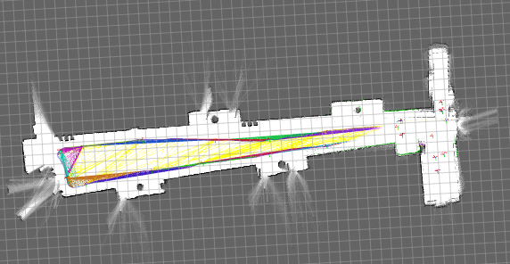

Mapping
========

**The following steps are running on ROS2GO platform**

Open a terminal, connect to your car.

First, set up ROS environment on both your car and your computer.

**On your computer**, config network variables by modifying your ~/.bashrc file:

.. code:: bash

    gedit ~/.bashrc

in the text editor, add these two lines to the bottom of the file.

.. code:: bash

    ROS_MASTER_URI=http://yourcarip:11311
    ROS_IP=`hostname -I`

where "yourcarip" is the IP address of your car (192.168.50.10*). 

**On your car** (first ssh -X to your car), config network variables by the same steps.

.. code:: bash

    gedit ~/.bashrc

in the text editor, add these two lines to the bottom of the file.

.. code:: bash

    ROS_MASTER_URI=http://yourcarip:11311
    ROS_IP=`hostname -I`

where "yourcarip" is the IP address of your car (192.168.50.10*). 

You can use the following code to check if your environment variables have been set correctly

.. code:: bash

    echo $ROS_MASTER_URI
    echo $ROS_IP

Get into your computer's SLAM package

.. code:: bash

    roscd racecar_slam

Update to the latest SLAM package

.. code:: bash

    git pull origin master

Make the package

.. code:: bash
    
    cd ~/catkin_ws
    catkin_make

OK, **now close all terminals and open new terminals to do the following steps.**

Then ssh to your car and bring up everything on your car

.. code:: bash

    roslaunch racecar_bringup racecar_bringup.launch

Then go back to your own computer and open a new terminal. Run the mapping launch file to start mapping

.. code:: bash

    roslaunch racecar_slam racecar_laser_only_cartographer.launch

You should be able to see something like this

Tp save the map, open a new terminal and run

.. code:: bash

    rosrun map_server map_saver --occ 51 --free 49 -f test_carto_map
