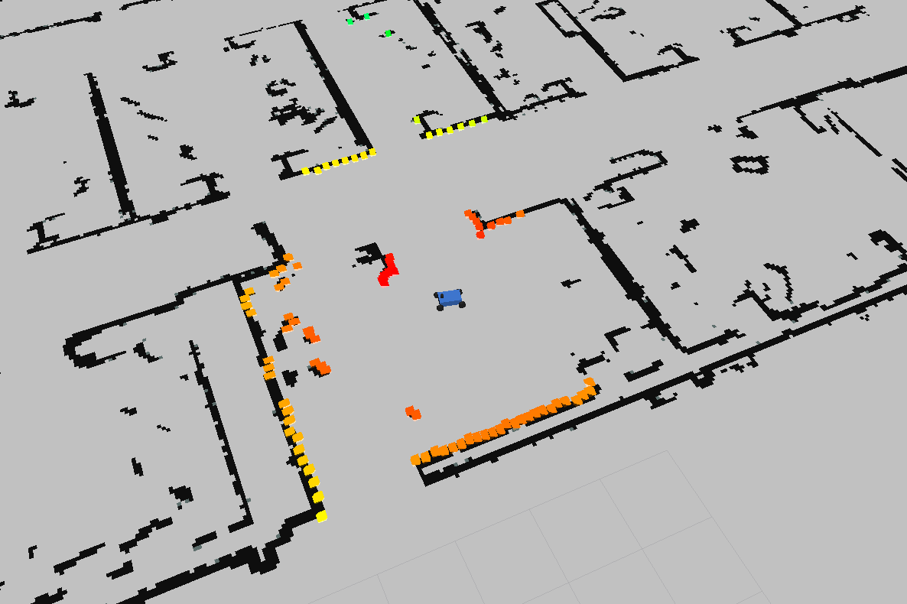

Use Rviz to simulate and control MIT Racecar model
==================================================
In this section we run 2-D simulation in Rviz using the MIT racecar model. Here we control the racecar in two ways:

	* Using the gamepad, 

	* Using custom Publisher and Subscriber.

Setup
~~~~~
First we need to install additional required packages. 

If you are running ubuntu 16.*, do the following:

.. code:: bash

    sudo apt-get install ros-kinetic-tf2-geometry-msgs ros-kinetic-ackermann-msgs ros-kinetic-joy ros-kinetic-map-server

If you are running ubunut 18.*, do the following:

.. code:: bash

    sudo apt-get install ros-melodic-tf2-geometry-msgs ros-melodic-ackermann-msgs ros-melodic-joy ros-melodic-map-server

Then we clone the github repo of `MIT Racecar`_ in our catkin_ws/src folder.

.. _MIT Racecar: https://github.com/mit-racecar/racecar_gazebo

.. code:: bash

    cd ~/catkin_ws/src
    git clone https://github.com/mit-racecar/racecar_simulator.git

Now go back up one stage and compile the new packages:

.. code:: bash

    cd ..
    catkin_make
    source ~/catkin_ws/devel/setup.bash

At this point all the required packages and libraries should be installed.

Quick Start
~~~~~~~~~~~

To run the simulation, in terminal we run:

.. code:: bash

    roslaunch racecar_simulator simulate.launch

This will bringup a server that runs everything including roscore, the simulator, a preselected map, a model of the racecar and the joystick server.

In order to visualize the simulation, we open the Rviz simulator by typing：

.. code:: bash

    rviz

You will see the GUI of rviz popping up, with an empty world. We then click "Add" in the lower-left panel, and select tab "By topic" and add the **/map** topic and then add the **/scan** topic. Under the "By display type" tab, we add the **RobotModel** type. 

In the left panel under the newly added LaserScan section, change the size to 0.1 meters for a clearer visualization of the lidar.

Controlling the car using gamepad
~~~~~~~~~~~~~~~~~~~~~~~~~~~~~~~~~

For this part, simply connect the usb receiver of your gamepad to your computer. **Switch the mode of the gamepad to D**, then you should be able to control the car using two joysticks. 

The rviz environment with the scanning car should look like this:

Controlling the car using publisher and subscriber
~~~~~~~~~~~~~~~~~~~~~~~~~~~~~~~~~~~~~~~~~~~~~~~~~~