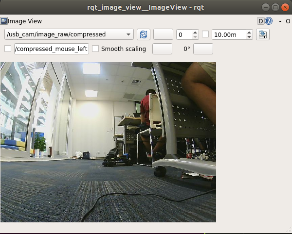

Use the USB-camera and run opencv on racecar
============================================

In this section we bring up the USB-camera on the racecar and run opencv for simple application. We monitor the process by streaming the video to our local computer.

Setup and bring up the USB_cam
~~~~~~~~~~~~~~~~~~~~~~~~~~~~~~

First sonnect to the car using ssh, with "-X" option, which enables graphics interface. 

.. code:: bash

	ssh -X tianbot@192.168.50.10*

Then simply running command:

.. code:: bash

	roslaunch usb_cam usb_cam-test.launch

A window will pop up, select the menu on the top-left corner for /usb_cam/image_raw/compressed, then we should be able to see the video from the camera.

Running opencv
~~~~~~~~~~~~~~

Opencv has already been installed on the Jetson Nano board on the racecar. To see it's version, we simply test:

.. code:: bash
	
    $ python
    Python 2.7.15rc1 (default, Nov 12 2018, 14:31:15) 
	[GCC 7.3.0] on linux2
	Type "help", "copyright", "credits" or "license" for more information.
    >>> import cv2
    >>> cv2.__version__
    >>> '3.3.1'

Unfortunately, for opencv version 3.3.1, the MultiTracker class(see the last tutorial that we run on the local computer) has not been supported. Here we demonstrate simple image processing techniques as follows:

Open USB_cam in opencv
----------------------

Here we demonstrate how to stream the USB_cam using opencv. Note that we don't need to launch any node to read the camera signal. First create a python file "streaming.py"

.. code:: bash

	gedit streaming.py

then copy and paste the following:

.. code:: bash

	import cv2

	cap = cv2.VideoCapture(0)

	while True:
	    success, frame = cap.read()
	    cv2.imshow("streaming",frame)
	    if cv2.waitKey(1) & 0xFF == 27:  # Esc pressed
	        break

Using Color filter
------------------

Here we demonstrate how to do simple color filtering.

First create another file called "filtering.py"

.. code:: bash 

	gedit filtering.py

Then copy and paste the following:

.. code:: python

	import numpy as np
	import cv2

	cap = cv2.VideoCapture(0)

	def nothing(x):
	    pass

	cv2.namedWindow('image',cv2.WINDOW_NORMAL)
	cv2.resizeWindow('image',(600,200))
	cv2.createTrackbar('minH', 'image', 0, 255, nothing)
	cv2.createTrackbar('minS', 'image', 0, 255, nothing)
	cv2.createTrackbar('minV', 'image', 0, 255, nothing)
	cv2.createTrackbar('maxH', 'image', 0, 255, nothing)
	cv2.createTrackbar('maxS', 'image', 0, 255, nothing)
	cv2.createTrackbar('maxV', 'image', 0, 255, nothing)

	while True:
	    _, frame = cap.read()
	    hsv = cv2.cvtColor(frame, cv2.COLOR_BGR2HSV) # convert to hsv encoding for better processing
	    
	    minH = cv2.getTrackbarPos('minH', 'image')
	    minS = cv2.getTrackbarPos('minS', 'image')
	    minV = cv2.getTrackbarPos('minV', 'image')
	    maxH = cv2.getTrackbarPos('maxH', 'image')
	    maxS = cv2.getTrackbarPos('maxS', 'image')
	    maxV = cv2.getTrackbarPos('maxV', 'image')

	    a = cv2.waitKey(5) & 0xFF
	    if a == ord('p'):
	        print('minH: ', minH, '\nmaxH: ', maxH,'\nminS : ', minS, '\nmaxS : ', maxS\
	          ,'\nminV : ',minV,'\nmaxV : ',maxV)
	    lowerpink = np.array([minH,minS,minV])
	    upperpink = np.array([maxH,maxS,maxV])
	    # print(lowerpink + '\n' + upperpink)

	    mask = cv2.inRange(hsv,lowerpink, upperpink)
	    res = cv2.bitwise_and(frame,frame, mask = mask)

	    # median = cv2.bilateralFilter(res,15,75,75)

	    # cv2.imshow('median',descale(median,3))
	    cv2.imshow('frame',frame)
	    cv2.imshow('mask',mask)
	    cv2.imshow('res',res)

	    k = cv2.waitKey(5) & 0xFF
	    if k == 27:
	        break

	cv2.destroyAllWindows()
	cap.release()

You shuold be able to use the slider and select the color you want. 

Edge detection
------------------
Here we demonstrate how to do simple edge detection.

First create another file called "edge.py"

.. code:: bash 

	gedit edge.py

Then copy and paste the following:

.. code:: python

	import cv2
	import numpy as np

	cap = cv2.VideoCapture(0)

	def nothing(x):
	    pass

	cv2.namedWindow('image',cv2.WINDOW_NORMAL)
	cv2.resizeWindow('image',(600,200))
	cv2.createTrackbar('th1', 'image', 0, 255, nothing)
	cv2.createTrackbar('th2', 'image', 0, 255, nothing)
	while True:
	    _, frame = cap.read()
	    
	    th1 = cv2.getTrackbarPos('th1', 'image')
	    th2 = cv2.getTrackbarPos('th2', 'image')

	    laplacian = cv2.Laplacian(frame,cv2.CV_64F)
	    sobelx = cv2.Sobel(frame,cv2.CV_64F, 1, 0, ksize = 5)
	    sobely = cv2.Sobel(frame,cv2.CV_64F, 0, 1, ksize = 5)
	    edges = cv2.Canny(frame, th1, th2)

	    newedges = cv2.cvtColor(frame,cv2.COLOR_BGR2GRAY)
	    ret,thresh = cv2.threshold(newedges,127,255,0)
	    cv2.imshow('thresh', thresh)
	    contours, hierarchy = cv2.findContours(edges,cv2.RETR_TREE,cv2.CHAIN_APPROX_SIMPLE)[-2:]
	    cv2.drawContours(frame,contours,-1,(0,0,255),1)
	    # print(len(contours))

	    # cv2.imshow('original',frame)
	    # cv2.imshow('laplacian',laplacian)
	    # cv2.imshow('sobelx',sobelx)
	    # cv2.imshow('sobely', sobely)
	    cv2.imshow('edges', edges)
	    cv2.imshow('frame', frame)

	    k = cv2.waitKey(5) & 0xFF
	    if k == 27:
	        break

	cv2.destroyAllWindows()
	cap.release()

You should be able to run the file and do simple edge detection.